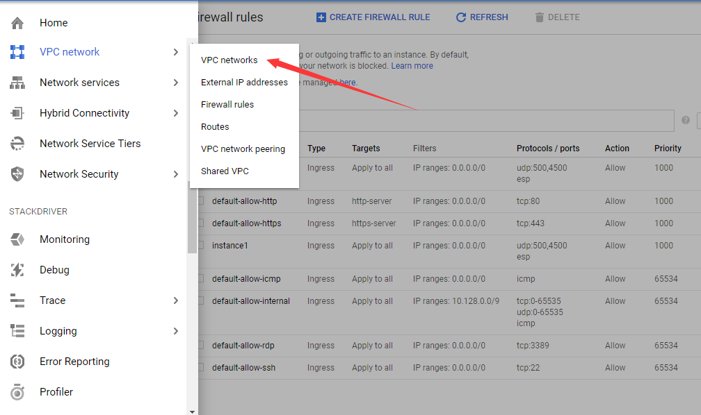

# Setup_VPN

A guide to create VPN by using Google Cloud

First, you need your **Google account**

Second, search **Google Cloud** and login

Third, start a project and **here we go!**

Enter `sudo apt-get update && apt-get dist-upgrade`

`wget https://git.io/vpnsetup -O vpnsetup.sh && sudo \

VPN_IPSEC_PSK='IPSEC_PSK' \

VPN_USER='UserName' \

VPN_PASSWORD='Password' sh vpnsetup.sh`

Loading.....

You are all set!
